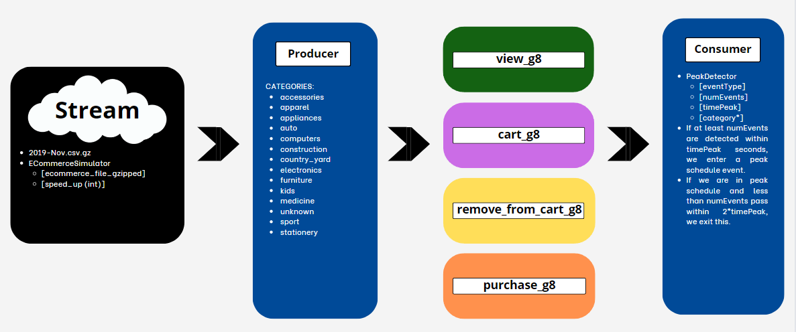

# Identifying Peak Hours in eCommerce

## Summary

The main goal of this project is to detect bursts of events by category and type of event (likely focusing on "view" and "purchase" events) and associate them with peak user interaction with the eCommerce platform.

The eCommerce behavior data from a multi-category store dataset is available <a href="https://www.kaggle.com/datasets/mkechinov/ecommerce-behavior-data-from-multi-category-store">here</a> The data includes events such as view, cart, remove_from_cart, and purchase, specifically from the file 2019-Nov.csv, which is part of the entire dataset (The entire dataset contains 285 million user events from an eCommerce website, and the subsample taken contains 67.5 million instances of those events.).

## Technologies

- Java 11.0.20
- Apache Kafka

## How to run this project
As spoken before, this project was build on top of the Kafka framework for Java, for the specific dataset considered there are 3 steps considered:
1. Theres a class available in ECommerceStream that reads the dataset compressed as a gzip and then reproduces the stream of data 




1. Clone this repository or download it into your machine
2. Run the build.xml to obtain a jar file
3. In a master machine with HDFS, Debian (It was executed on Debian so we don't know if it works for other linux distributions or OS) and Apache Kafka installed:
    1. **Create the next 4 topics**: *view_g8, cart_g8, remove_from_cart_g8, purchase_g8* (We considered a replication factor of 1 since there was not much space available and 1 partition since there wasn't gonna be a lot of consumers inside one topic at the same time in our case, please consider changing them if you need).
    ```
    kafka-topics.sh --create --zookeeper localhost:2181 --replication-factor 1 --partitions 1 --topic [topic-name]    
    ```
    2. Inside a folder with the .gzip dataset and .jar file run the stream simulation:
    ```
    java -jar mdp-kafka.jar ECommerceSimulator ./2019-Nov.csv.gz [speed_up]  
    ```
    3. On another terminal, run some consumers to read from any of the topics availables (You can specify the category at the end if you want, if nothing is passed then it reads all the files without filtering by category)
    ```
    java -jar mdp-kafka.jar PeakDetector [Topic] [numEvents] [timePeak] [category*]
    ```
    4. After a while there shoud appear in the terminal the events as follow:
    ```shell
    "START event-id: [id] : start: [UNIX_TIME] value: [ROW] rate: [numEvents] records in [timePeak] ms"
    "END event: [id] : finish: [UNIX_TIME] value: [ROW] rate: [numEvents] records in [timePeak] ms"
    ```

## Results


## Conclusions

